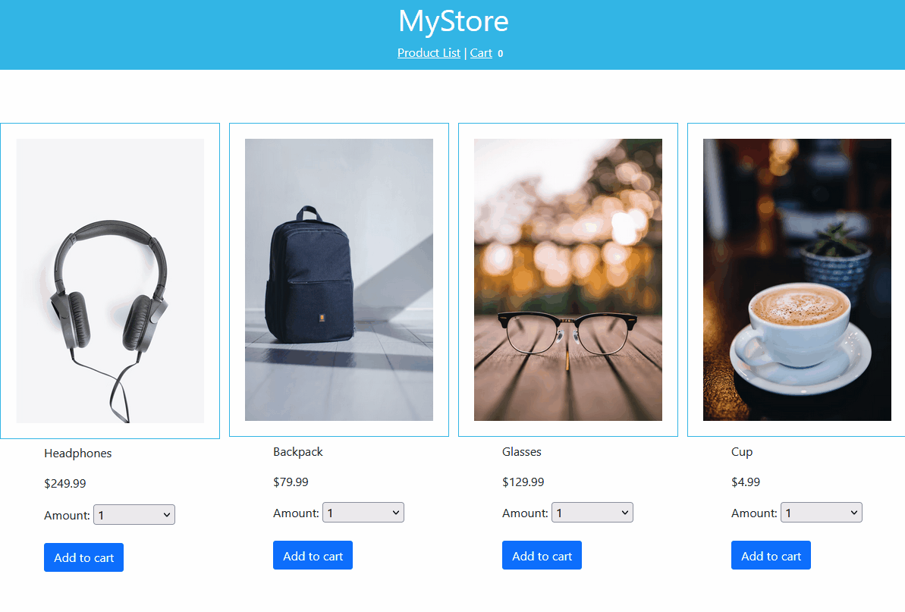

# MyStore

Frontend for an online store.


## Features

Allows user to:
* Browse product list
* View details for a product by clicking on its image
* Add products to a shopping cart
* Checkout


## Demo




## Table of content

* [Installation](#installation)
* [How to run this project](#how-to-run-this-project)
* [Modifications for production](#modifications-for-production)
* [Further information](#further-information)


## Installation

This project requires [**Node**](https://nodejs.org/en) and [**Angular**](https://github.com/angular/angular-cli).

1. Check if Angular CLI is already installed:
    ```
        ng --version
    ```
    To install Angular CLI *globally* from [npm](https://www.npmjs.com) run:
    ```
        npm i -g @angular/cli
    ```
2. Install required Node modules by executing this command in the root folder of the project:
    ```
        npm install
    ```
    

## How to run this project

To serve application on `localhost` with port `4200` run:
```
    ng serve
```
If you prefer other host or port use:
```
    ng serve --port <port> --host <host>
```
The application reloads automatically whenever changes in code files are saved.


## Modifications for production

To use this project with your store backend:
1. Replace `../../assets/data.json` with the **URL** of your endpoint
in `src/app/services/product.service.ts > getProducts()`:
    ```ts
        // Fetch data 
        const observable = this.http.get<Product[]>('../../assets/data.json');
    ```
2. Add code to submit `cart` and `user` data to your backend
in `src/app/components/checkout.component.ts > onSubmit()`.
    ```ts
        onSubmit(): void {
            // Add logic here to send cart and user data to your backend

            this.router.navigate(['/confirmation']);
        }
    ```
    Shape of the data can be found at `src/app/models`.

## Further information

This project was generated with [Angular CLI](https://github.com/angular/angular-cli) version 13.3.7.

`data.json` and most of *CSS* used in this project have been provided by [Udacity](https://github.com/udacity/nd-0067-c3-angular-fundamentals-project-starter/tree/main/src).